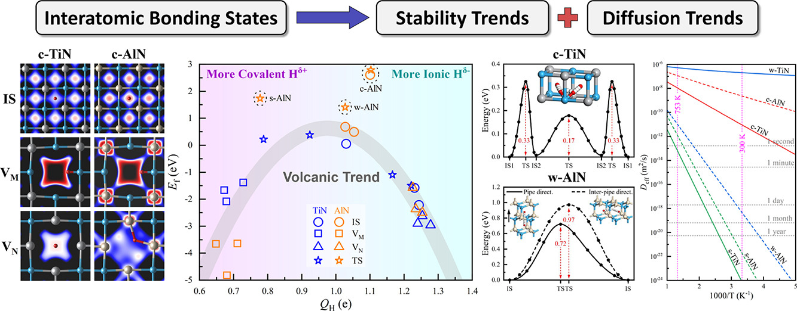

# 何钦生（Qinsheng He） 
*PhD Candidate*  
📍 Xi'an, China 
| [GitHub](https://github.com/QS-He)
| [ResearchGate](https://www.researchgate.net/profile/He-Qin-Sheng?ev=prf_overview) |

## 📮 联系方式 (Contact Me)
**📧 邮件（Email）**
  heqinsheng@nimte.ac.cn

**📱 电话（Tel）**
  173 4781 1227

---

## 🎓 教育背景 (Education)
| 时间 (Period) | 院校 (Institution) | 学院/中心 (Department/Center) | 学位 (Degree) |
|---------------|--------------------|-------------------------------|---------------|
| 2017.09 - 2021.06 | 重庆大学 | 材料科学与工程学院 | 工学学士 (BSc) |
| 2021.09 - 2024.06 | 宁波大学 | 材料科学与化学工程学院 | 材料与化工硕士 (MSc) |
| 2021.09 - 2024.06 | 中科院宁波材料所 | 前沿交叉科学研究中心 | 联合培养硕士 |
| 2024.09 - 2025.06 | 西安交通大学 | 航天航空学院 | 研究助理 (RA) |
| 2025.09 - 至今 | 西安交通大学 | 航天航空学院 | 博士研究生 |

---

## 🔬 研究方向 (Research Interests)
### 硕士 

过渡金属氮化物涂层中的缺陷动力学 （Defect Dynamics in Transition Metal Nitride Coatings）

### 博士 
锂电池正极材料的力学-化学耦合失效（Mechanical-Chemical Coupling Failure in Lithium Battery Cathodes ） 

---

## 📑 第一作者工作（First-Author Works）

1. **Q. He**, T.-Y. Sun, L.-F. Huang*, *Chemical-bonding and lattice-deformation mechanisms unifying the stability and diffusion trends of hydrogen in TiN and AlN polymorphs*, **Acta Materialia** 281, 120447 (2024). | [DOI](https://doi.org/10.1016/j.actamat.2024.120447) | 📰[官网报道](https://www.nimte.ac.cn/news/progress/202412/t20241203_7449883.html)

  

（展开/折叠）化学键合和晶格变形机制统一了氢在多结构TiN和AlN中的稳定性和扩散趋势

  
- 以“成键机制决定了热力学和动力学趋势”为主线，通过第一性原理计算系统阐明了原子氢在 TiN 与 AlN 三种晶体结构中的行为。

- 首先分析了 H–N 和 H–Metal 的共价-离子混合化学成键模式，发现成键强度受氢的电子个数（QH）调控，从而构建出普适的Ef–QH“火山曲线”规律：QH 接近 1 e（中性）时氢最不稳定，偏离该值时因更强的离子或共价相互作用而趋于稳定。

- 这一成键机制直接决定了热力学趋势:氢在间隙位形成能或高达 +2.3 eV，而在空位或晶界处形成能骤降至 −2.6 eV，极易被捕获。

- 进一步将火山关系外推到扩散动力学：成键类型沿扩散路径的突变（如 H–Ti 离子键 切换到 H–N 共价键）导致高势垒（0.47–2.11 eV），而键型保持一致的通道则势垒极低（0.08–0.17 eV）；同时晶格畸变对势垒的定量贡献可达 0.8 eV，与化学成键协同控制扩散系数跨越 106 量级。

- 提出涂层阻氢的“热力学屏障”与“动力学屏障”双重判据，解释了实验报道的氮化物涂层多变的氢渗透率（与晶界等缺陷通道密切相关），并为面向严苛服役环境的高可靠氢渗透阻挡涂层提供了可量化的设计原则。

 

— — — — — — — — — — — — — — — — — — — — — — — — — — — — — — — — — — — — — — — — — — — — — — — — —

   
2. **Q. He**#, D. Liu#, Y. Zhou#, T.-Y. Sun, L.-F. Huang*, *Nitride coatings for environmental barriers: the key microscopic mechanisms and momentous applications of first-principles calculations*, **Surface Science and Technology** 2, 24 (2024). | [DOI](https://doi.org/10.1007/s44251-024-00053-6)

氮化物屏障用作环境涂层：来自第一性原理计算的关键微观机制和重大应用

  

 

---

## 🔗 合作工作（Collaborative Works）
1. Y. Jin, **Q. He**, G. Liu, et al., *Fluorinated Li10GeP2S12 enables stable all-solid-state lithium batteries*, **Advanced Materials** 35, 2211047 (2023). | [DOI](https://doi.org/10.1002/adma.202211047) | 🔥高被引

氟化Li10GeP2S12电解质稳定全固态锂电池

  

 

— — — — — — — — — — — — — — — — — — — — — — — — — — — — — — — — — — — — — — — — — — — — — — — — —

2. N. Zhang, **Q. He**, L. Zhang, et al., *Homogeneous Fluorine Doping toward Highly Conductive and Stable Li10GeP2S12 Solid Electrolyte for All-Solid-State Lithium Batteries*, **Advanced Materials** 36, 2408903 (2024). | [DOI](https://doi.org/10.1002/adma.202408903) | 🔥高被引

均匀氟掺杂实现高电导高稳定的Li10GeP2S12电解质以迈向全固态锂电池

  

 

— — — — — — — — — — — — — — — — — — — — — — — — — — — — — — — — — — — — — — — — — — — — — — — — —

3. X. Fan#, W. He#, Z. Zhang#, B. He, Y. Lin, **Q. He**, L.-F. Huang, S. Ren*, Z. Lu*, J. Pu*, Q. Xue, *Enhancing irradiation tolerance and inducing superlubricity in MoS2/W multilayer film exposed to atomic oxygen*, **Communications Materials** 6, 160 (2025). | [DOI](https://www.nature.com/articles/s43246-025-00884-2)

原子氧辐照环境下 MoS₂/W 多层膜的耐辐照性能提升及超润滑行为诱导

  

 
